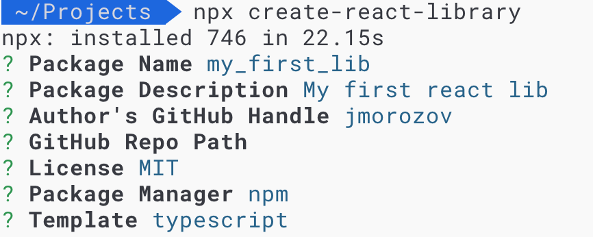
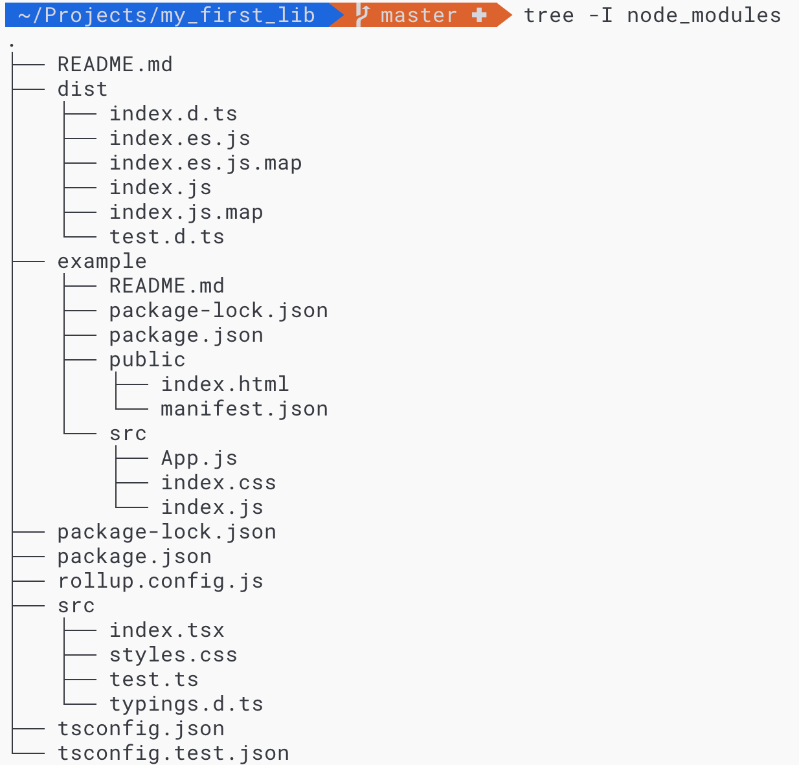

Большую часть свой работы, я пишу бэкенды, но вот на днях появилась задача начать библиотеку компонентов на React. Несколько лет назад, когда версия React была такой же маленькой, как и мой опыт фронтенд-разработки, я уже делал подход к снаряду и получилось неумело и коряво. Принимая во внимание зрелость текущей экосистемы React и мой подросший опыт, я воодушевился уж в этот-то раз сделать всё хорошо и удобно. В результате у меня появилась заготовка для будущей библиотеки, а чтобы ничего не забыть и собрать всё в одном месте, была написана эта статья-шпаргалка, которая также должна помочь тем, кто не знает, с чего начать. Посмотрим, что же у меня получилось.

**_TL/DR: Код готовой к старту библиотеки можно посмотреть на [github](https://github.com/jmorozov/react-library-example)_**

К задаче можно подойти с двух сторон:
1. Найти готовый starter-kit, Boilerplate или cli-генератор
2. Собрать всё самому

Первый способ хорош для супер-быстрого старта, когда вы совершенно не хотите разбираться с конфигурированием и подключением необходимых пакетов. Также этот вариант подойдёт для новичков, кто не знает с чего начать и в чём должно быть отличие бибилиотеки от обычного приложения.

Вначале я пошёл первым путём, но затем решил обновить зависимости и прикрутить ещё пару пакетов, и тут посыпались всякие ошибки и несостыковки. В итоге закатал рукава и переделал всё сам. Но про генератор библиотек таки упомяну.

## Create React Library

Большинство разработчиков, которые имели дело с React слышали про удобный стартер приложений на React, который позволяет свести конфигурацию проекта к минимуму и предоставляет разумные дефолты - [Create React App](https://github.com/facebook/create-react-app) (CRA). В принципе, его можно было бы использовать и для библиотеки. Однако, структура проекта и подход к разработке ui-kit немного отличается от обычного SPA. Нам нужен отдельный каталог с исходниками компонентов (src), песочница для их разработки и отладки (example), инструмент документирования и демонстрации ("витрина") и отдельный каталог с подготовленными к экспорту файлами (dist). Также компоненты библиотеки не будут складываться в SPA приложения, а будут экспортироваться через индексный файл. Подумав об этом, я отправился на поиски и быстро обнаружил подобный CRA пакет - [Creat React Library](https://github.com/transitive-bullshit/create-react-library) (CRL).

CRL, также как и CRA, является "easy-to-use" CLI-утилитой. С помощью неё можно сгенерировать проект. Он будет содержать:
- настроенный [Rollup](https://rollupjs.org/guide/en/) для сборки cjs и es модулей и source map с поддержкой css-модулей
- [babel](https://babeljs.io/) для транспиляции в ES5
- [Jest](https://jestjs.io/) для тестов
- TypeScript (TS) как опция, которой мы хотели бы воспользоваться

Для генерации проекта библиотеки выполним:

npx create-react-library

([npx](https://medium.com/devschacht/introducing-npx-an-npm-package-runner-a72a658cd9e6) позволяет не устанавливать пакеты глобально)

Ответим на предложенные вопросы:

И в результате работы утилиты получим сгенерированный и готовый к работе проект библиотеки компонентов, следующей структуры:

На сегодняшний день зависимости немного устаревшие, поэтому я решил обновить их всех до последних версий с помощью [npm-check](https://www.npmjs.com/package/npm-check):

npx npm-check -u

Также пакет `react-scripts-ts` объявлен `deprecated` и больше не поддерживается. Вместо него следует установить `react-scripts`, потому что с некоторых пор CRA (чьим пакетом является `react-scripts`) поддерживает TypeScript из коробоки (с помощью Babel 7).

Ещё одним печальным фактом является то, что приложение-песочница в каталоге `example` генерируется на js. Придётся руками переписать его на TypeScript, добавив `tsconfig.json` и некоторые зависимости (например, сам `typescript` и основные `@types`).

На этом я закончу рассказ о настройке проекта после генерации CLR, потому что не осилил натягивание конфига `react-scripts` на мое представление о библиотеке. Насколько я помню, Jest из этого пакета требовал опции компилятора `isolatedModules`, которая шла в разрез с моим желанием генерировать и экспортировать `d.ts` из библиотеки (всё это как-то связано с ограничениями Babel 7, который используется Jest и `react-scripts` для компиляции TS). Поэтому я сделал `eject` для `react-scripts`, посмотрел на результат и переделал всё руками, чем мы сейчас и займёмся.

## Берём управление в свои руки

Итак, начнём с начала. Запускаем `npm init` и генерируем `package.json` для библиотеки. Добавим туда немного информации о нашем пакете. Например, пропишим минимальные версии для node и npm в поле `engines`. Собранные и эспортируемые файлы будем помещать в каталог `dist`. Пропишем это в поле `files`. Мы создаём библиотеку компонентов react, поэтому рассчитываем на то, что у пользователей будут стоять необходимые пакеты - прописываем в поле `peerDependencies` минимальные неоходимые версии `react` и `react-dom`.

Теперь установим пакеты `react` и `react-dom` и необходимые types (т.к. мы будем пилить компоненты на TypeScript) как devDependencies (как и все пакеты в этой статье):

npm install --save-dev react react-dom @types/react @types/react-dom


Установим TypeScript:

npm install --save-dev typescript

Создадим файлы конфигурации для основного кода и тестов: `tsconfig.json` и `tsconfig.test.json`. Наш `target` будет в `es5`, будем генерировать `sourceMap` и т.д. С полным списком возможных опций и их значений можно ознакомиться в [документации](https://www.typescriptlang.org/docs/handbook/compiler-options.html). Не забудем в `include` указать каталог с исходниками, а в `exclude` добавить каталоги `node_modules` и `dist`. В `package.json` укажем в поле `typings`, где взять типы для нашей библиотеки - `dist/index`.

Создадим каталог `src` для исходников компонентов библиотеки. Добавим всякие мелочи, вроде `.gitignore`, `.editorconfig`, файла с лицензией и `README.md`.

### Rollup

Для сборки будем использовать Rollup, как предлагал CRL. Необходимые пакеты и конфиг, я подсматривал также у CRL. Вообще я слышал мнение, что Rollup хорош для библиотек, а Webpack для приложений. Однако, я не конфигурировал Webpack (мне хватало того, что делает за меня CRA), но Rollup действительно хорош, прост и красив.

Установим:

npm install --save-dev rollup rollup-plugin-babel rollup-plugin-commonjs rollup-plugin-node-resolve rollup-plugin-peer-deps-external rollup-plugin-postcss rollup-plugin-typescript2 rollup-plugin-url @svgr/rollup


В `package.json` добавим поля с распложением собранных бандлов библиотеки, как рекомендует нам `rollup` - [pkg.module](https://github.com/rollup/rollup/wiki/pkg.module):

   "main": "dist/index.js",
   "module": "dist/index.es.js",
   "jsnext:main": "dist/index.es.js"


Создадим конфигурационный файл `rollup.config.js`:

import typescript from 'rollup-plugin-typescript2';
import commonjs from 'rollup-plugin-commonjs';
import external from 'rollup-plugin-peer-deps-external';
import postcss from 'rollup-plugin-postcss';
import resolve from 'rollup-plugin-node-resolve';
import url from 'rollup-plugin-url';
import svgr from '@svgr/rollup';

import pkg from './package.json';

export default {
   input: 'src/index.tsx',
   output: [
      {
         file: pkg.main,
         format: 'cjs',
         exports: 'named',
         sourcemap: true
      },
      {
         file: pkg.module,
         format: 'es',
         exports: 'named',
         sourcemap: true
      }
   ],
   plugins: [
      external(),
      postcss({
         modules: false,
         extract: true,
         minimize: true,
         sourceMap: true
      }),
      url(),
      svgr(),
      resolve(),
      typescript({
         rollupCommonJSResolveHack: true,
         clean: true
      }),
      commonjs()
   ]
};


Конфиг представляет собой js-файл, а точнее экспортируемый объект. В поле `input` указываем файл, в котором прописаны экспорты для нашей библиотеки. `output` - описывает наши ожидания на выходе - в модуль какого формата скомпилировать и куда его положить.
Далее идёт поле со списком и конфигурацией плагинов:
- [rollup-plugin-peer-deps-external](https://www.npmjs.com/package/rollup-plugin-peer-deps-external) - позволяет исключить peerDependencies из bundle, чтобы уменьшить его размер. Это резонно, ибо наличие peerDependencies ожидается от пользователя библиотеки
- [rollup-plugin-postcss](https://github.com/egoist/rollup-plugin-postcss) - интегрирует [PostCss](https://github.com/postcss/postcss) и Rollup. Тут мы отключаем css-modules, включаем в экспортную поставку от нашей библиотеки css, минимизируем его и включаем создание sourceMap. Если вы не экспортируете никакого css, кроме используемого компонентами библиотеки, то extract можно избежать - необходимый в компонентах css будет по необходимости добавлен в тег head на странице в конечном итоге. Однако в моём же случае необходимо раздавать ещё некоторый дополнительный css (сетка, цвета и т.п.), и клиенту придётся явно подключать себе css-bundle библиотеки.
- [rollup-plugin-url](https://github.com/rollup/rollup-plugin-url) - позволяет экспортировать различные ресурсы, вроде картинок
- [svgr](https://github.com/smooth-code/svgr) - трансформирует svg в React-компоненты
- [rollup-plugin-node-resolve](https://github.com/rollup/rollup-plugin-node-resolve) - определяет расположение сторонних модулей в node_modules
- [rollup-plugin-typescript2](https://www.npmjs.com/package/rollup-plugin-typescript2) - подключает компилятор TypeScript и предоставляет возможность для его конфигурации
- [rollup-plugin-commonjs](https://github.com/rollup/rollup-plugin-commonjs) - конвертирует commonjs-модули зависимостей в es-модули, чтобы их можно было включить в bundle

Добавим в поле `scripts` `package.json` команду для сборки (`"build": "rollup -c"`) и запуска сборки в watch-режиме во время разработки (`"start": "rollup -c -w && npm run prettier-watch"`).

### Первый компонент и экспортный файл

Теперь напишем простейший react-компонент, чтобы проверить как работает наша сборка. Каждый компонент в библиотеке будем помещать в отдельный каталог в родительском каталоге - `src/components/ExampleComponent`. В этом каталоге будут содержаться все связанные с компонентом файлы - tsx, css, test.tsx и проч.
Создадим какой-нибудь файл стилей для компонента и tsx-файл самого компонента, например `ExampleComponent.tsx`:

/**
 * @class ExampleComponent
 */

import * as React from 'react';

import './ExampleComponent.css';

export interface Props {
   /**
    * Simple text prop
    **/
   text: string;
}

/** My First component */
export class ExampleComponent extends React.Component<Props> {
   render() {
      const { text } = this.props;

      return (
         

            Example Component: {text}
            
Coool!

         

      );
   }
}

export default ExampleComponent;


Также в `src` надо создать файл с общими для библиотеками типами, где будет объявлен тип для css и svg - `typings.d.ts` (подсмотрено у CRL):

/**
 * Default CSS definition for typescript,
 * will be overridden with file-specific definitions by rollup
 */
declare module '*.css' {
   const content: { [className: string]: string };
   export default content;
}

interface SvgrComponent extends React.FunctionComponent<React.SVGAttributes<SVGElement>> {}

declare module '*.svg' {
   const svgUrl: string;
   const svgComponent: SvgrComponent;
   export default svgUrl;
   export { svgComponent as ReactComponent };
}


Все экспоритруемые компоненты и css должны быть указаны в экспортном файле. У нас это - `src/index.tsx`. Если какой-то css не используется в проекте и не указан в составе импорируемых в `src/index.tsx`, то он будет выкинут из сборке, что прекрасно. Вот содержимое:


import { ExampleComponent, Props } from './ExampleComponent';
import './export.css';

export { ExampleComponent, Props };


Теперь можно попробовать собрать библиотеку - `npm run build`. В результате запуститься rollup и соберёт нашу библиотеку в бандлы, которые мы найдём в каталоге `dist`.

Далее добавим несколько инструментов для повышения качества нашего процесса разработки и его результата.

### Забываем о форматировании кода с Prettier

Терпеть не могу в code-review указывать на небрежное или нестандартное для проекта форматирование, а тем более спорить про него. Подобные недочёты естественно должны быть исправлены, однако разработчикам лучше сосредоточиться на том, что и как код делает, а не как он выглядит. Подобные исправления первый кандидат на автоматизацию. Есть прекрасный пакет под эту задачу - [prettier](https://prettier.io/). Установим его:

npm install --save-dev prettier


Добавим конфиг для небольшого уточнения правил форматирования - `.prettierrc.json`

{
   "tabWidth": 3,
   "singleQuote": true,
   "jsxBracketSameLine": true,
   "arrowParens": "always",
   "printWidth": 100,
   "semi": true,
   "bracketSpacing": true
}

Посмотреть значение этих и других доступных правил можно в [документации](https://prettier.io/docs/en/options.html). WebStrom после создания файла конфигурации сама предложит использовать `prettier` при запуске форматирования через IDE. Чтобы форматирование не тратило время впустую, добавим в исключения каталог `/node_modules` и `/dist` с помощью файла `.prettierignore` (формат аналогичен `.gitignore`). Теперь можно запустить `prettier`, применив правила форматирования к исходному коду:

prettier --write "**/*"


Чтобы не запускать команду явно каждый раз руками и быть уверенным, что код остальных разработчиков проекта также будет отформатирован `prettier`, добавим запуск `prettier` на precommit-hook для файлов, отмеченных как `staged` (через `git add`). Для такого дела нам нужно два инструмента. Во-перых - это [hasky](https://github.com/typicode/husky), ответсвенного за выполнение каких-либо команд перед коммитом, пушем и т.п. А во-вторых - это [lint-staged](https://github.com/okonet/lint-staged), который может запускать разные линтеры на `staged` файлы. Нам нужно выполнить всего лишь одну строчку, чтобы поставить эти пакеты и добавить команды запуска в `package.json`:

npx mrm lint-staged


Мы можем не ждать форматирования до коммита, а сделать так, чтобы `prettier` постоянно срабатывал на изменённые файлы в процессе нашей работы. Да, нам нужен ещё один пакет - [onchange](https://github.com/Qard/onchange). Он позволяет следить за изменениями файлов в проекте и тут же выполнять необходимую для них команду. Устанавливаем:

npm install --save-dev --save-exact onchange

Затем в команды поля `scripts` в `package.json` добавляем:

"prettier-watch": "onchange 'src/**/*' -- prettier --write {{changed}}"


На этом все споры о форматирвании в проекте можно считать закрытыми.

### Избегаем ошибок с ESLint

[ESLint](https://eslint.org/) уже давно стал стандартом и его можно встретить практически во всех js и ts-проектах. Нам он тоже поможет. В конфигурировании ESLint я доверяю CRA, поэтому просто возьмём необходимые пакеты из CRA и подключим в нашу библиотеку. Кроме того, добавим конфиги для TS и prettier (чтобы избежать конфиктов между eslint и prettier):

npm install --save-dev eslint eslint-config-react-app eslint-loader eslint-plugin-flowtype eslint-plugin-import eslint-plugin-jsx-a11y eslint-plugin-react eslint-plugin-react-hooks @typescript-eslint/eslint-plugin @typescript-eslint/parser babel-eslint eslint-config-prettier eslint-plugin-prettier


Настроим eslint с помощью конфигурационного файла `.eslintrc.json`:

{
   "extends": [
      "plugin:@typescript-eslint/recommended",
      "react-app",
      "prettier",
      "prettier/@typescript-eslint"
   ],
   "plugins": [
      "@typescript-eslint",
      "react"
   ],
   "rules": {
      "@typescript-eslint/no-empty-interface": "off",
      "@typescript-eslint/explicit-function-return-type": "off",
      "@typescript-eslint/explicit-member-accessibility": "off"
   }
}

Добавим в поле `scripts` из `package.json` команду `lint` - `eslint src/**/* --ext .ts,.tsx --fix`. Теперь можно запустить eslint через `npm run lint`.

### Тестируем с Jest

Чтобы писать модульные тесты для компонентов библиотеки, установим и сконфигурируем [Jest](https://jestjs.io/) - библиотеку тестирования от facebook. Однако, т.к. мы компилируем TS не через babel 7, а через tsc, то нам нужно также установить пакет [ts-jest](https://kulshekhar.github.io/ts-jest/):

npm install --save-dev jest ts-jest @types/jest

Чтобы jest нормально воспринимал импорты css или других файлов, необходимо подменить их моками. Создаём каталог `__mocks__` и создаём там два файла.
`styleMock.ts`:

module.exports = {};

`fileMock.ts`:

module.exports = 'test-file-stub';

Теперь создаём конфиг jest - `jest.config.js`:

module.exports = {
   preset: 'ts-jest',
   testEnvironment: 'node',
   moduleNameMapper: {
      '\\.(css|less|sass|scss)$': '<rootDir>/__mocks__/styleMock.ts',
      '\\.(gif|ttf|eot|svg)$': '<rootDir>/__mocks__/fileMock.ts'
   }
};


Напишем простейший тест для нашего `ExampleComponent` в его каталоге - `ExampleComponent.test.tsx`:

import { ExampleComponent } from './ExampleComponent';

describe('ExampleComponent', () => {
   it('is truthy', () => {
      expect(ExampleComponent).toBeTruthy();
   });
});

Добавим в поле `scripts` из `package.json` команду `test` - `npm run lint && jest`. Для надёжности ещё и прогоним линтер. Теперь можно запустить наши тесты и удостовериться, что они проходят - `npm run test`. А чтобы при сборке тесты не попали в `dist` добавим к конфиге Rollup плагину typescritp поле `exclude` - `['src/**/*.test.(tsx|ts)']`. Добавим запуск тестов в `husky pre-commit hook` перед запуском `lint-staged` - `"pre-commit": "npm run test && lint-staged"`.

### Разрабатываем, документируем и любуемся компонентами с Storybook

Каждая библиотека нуждается в хорошей документации для её успешного и продуктивного использвания. Что касается библиотеки компонентов интерфейса, то про них не только хочется прочитать, но и посмотреть как они выглядят, а лучше всего потрогать и поизменять. Для поддержки такой хотелки есть несколько решений. Раньше я использовал [Styleguidist](https://github.com/styleguidist/react-styleguidist). Этот пакет позволяет писать документацию в формате markdown, а также вставлять в неё примеры описываемых React-компонентов. Далее документация собирается и из неё получается сайт-витрина-каталог, где можно найти компонент, прочитать документацию о нём, узнать о его параметрах, а также потыкать в него палочкой.

Однако в этот раз я решил присмотреться к его конкуренту - [Storybook](https://storybook.js.org/). На сегодняшний момент он кажется более мощным с его системой плагинов. Кроме того, он постоянно развивается, имеет большое сообщество и [скоро](https://medium.com/storybookjs/storybook-docs-sneak-peak-5be78445094a) также начнёт генерировать свои страницы документации с помощью markdown-файлов. Ещё одно достоинство Storybook это то, что он является песочницей - средой для изолированной разработки компонентов. Это означает, что нам не нужны никакие полноценные приложения-примеры для разработки компонентов (как это предлагает CRL). В storybook мы пишем stories - ts файлы, в которых мы передаём наши компоненты с некоторыми входыми props в специальные функции (лучше взгянуть на код, чтобы стало понятнее). В итоге из этих stories собирается приложение-витрина.

Запустим скрипт, который выполнит инициализацию storybook:

npx -p @storybook/cli sb init

Теперь подружим его с TS. Для этого нам нужно ещё немного пакетов, а заодно поставим пару полезных аддонов:

npm install --save-dev awesome-typescript-loader @types/storybook__react @storybook/addon-info react-docgen-typescript-loader @storybook/addon-actions @storybook/addon-knobs @types/storybook__addon-info @types/storybook__addon-knobs webpack-blocks

Скрипт создал каталог с конфигурацией storybook - `.storybook` и каталог с примером, который мы безжалостно удаляем. А в каталоге конфигураций меняем расширение addons и config на ts. В файл `addons.ts` подключим аддоны:

import '@storybook/addon-actions/register';
import '@storybook/addon-links/register';
import '@storybook/addon-knobs/register';

Теперь, надо помочь storybook с помощью конфига webpack в каталоге `.storybook` - `webpack.config.js`:

module.exports = ({ config }) => {
   config.module.rules.push({
      test: /\.(ts|tsx)$/,
      use: [
         {
            loader: require.resolve('awesome-typescript-loader')
         },
         // Optional
         {
            loader: require.resolve('react-docgen-typescript-loader')
         }
      ]
   });
   config.resolve.extensions.push('.ts', '.tsx');
   return config;
};

Немного подправим конфиг `config.ts`, добавив декораторы для подключения аддонов ко всем нашим stories:

import { configure } from '@storybook/react';
import { addDecorator } from '@storybook/react';
import { withInfo } from '@storybook/addon-info';
import { withKnobs } from '@storybook/addon-knobs';

// automatically import all files ending in *.stories.tsx
const req = require.context('../src', true, /\.stories\.tsx$/);

function loadStories() {
   req.keys().forEach(req);
}

configure(loadStories, module);

addDecorator(withInfo);
addDecorator(withKnobs);


Напишем нашу первую story в каталоге компонента `ExampleComponent` - `ExampleComponent.stories.tsx`:

import * as React from 'react';
import { storiesOf } from '@storybook/react';
import { ExampleComponent } from './ExampleComponent';
import { text } from '@storybook/addon-knobs/react';

const stories = storiesOf('ExampleComponent', module);

stories.add('ExampleComponent', () => <ExampleComponent text={text('text', 'Some text')} />, {
   info: { inline: true },
   text: `

  ### Notes

  Simple example component

  ### Usage
  ~~~js
  <ExampleComponent
    text="Some text"
  />
  ~~~

`
});

Мы использовали аддоны:
- [knobs](https://www.npmjs.com/package/@storybook/addon-knobs) - позволяет в режиме реального вермени менять props в отображемом в Storybook компоненте. Для этого необходимо оборачивать props в специальные функции в stories
- [info](https://www.npmjs.com/package/@storybook/addon-info) - позволяет добавлять документацию и описание props на страницу story

Теперь обратим внимание, что скрипт инициализации storybook добавил к нам в `package.json` команду `storybook`. Теперь воспользуемя ей для запуска `npm run storybook`. Storybook соберётся, запуститься по адресу `http://localhost:6006`. Не забудим таже добавить в исключение для модуля typescript из конфига Rollup - `'src/**/*.stories.tsx'`.

### Разрабатываем

Итак, окружив себя множеством удобных инстументов и приготових их к работе, можно приступить к разработке новых компонентов. Каждый компонент будем помещать в свой каталог в `src/components` с названием компонента. В нём будут находится все связанные с ним файлы - css, сам компонент в tsx-файле, тесты, stories. Запускаем storybook, создаём для компонента stories, там же пишем к нему документацию. Создаём тесты и тестируем. Импорт-экспорт готового компонента записываем в `index.ts`.

Кроме того, можно выполнить логин в npm и сделать опубликовать свою библиотеку как новый npm-пакет. А можно подключать её прямо из git-репозитория как из master, так и из других веток. Например, для моей заготовки можно выполнить:

npm i -s git+https://github.com/jmorozov/react-library-example.git

В приложении-потребителе нашей библиотеки в каталоге `node_modules` будет только содержимое каталога `dist` в собранном состоянии. Также, благодаря TS, будет работать автодополнение в IDE.

## Подводим итоги

В середине 2019 года можно довольно быстро начать разрабатывать свою библиотеку компонентов на React и TypeScript, пользуясь удобными инструментами разработки. Этого результата можно достичь как с помощью автоматизированной утилиты (с оговорками на свежесть пакетов и проч.), так и в ручном режиме. Второй путь является предпочтительным, если нужны актуальные пакеты и больше контроля. Главно знать куда копать, а с помощью примера в этой статье, я надюсь, это стало несколько проще.

Вы также можете взять получившуюся заготовку [тут](https://github.com/jmorozov/react-library-example).

Кроме всего прочего, я не претендую на истину в последней инстанции и, вообще, занимаюсь фронтендом постольку-поскольку. Вы можете выбрать альтернативные пакеты и опции конфигурации и также достичь успеха в создании своей библиотеки компонентов. Буду рад, если вы поделитесь в комментариях своими рецептами. Happy coding!